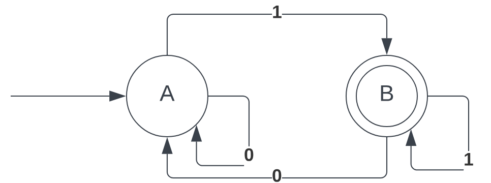

# Example of Readme for Evidence

# Description
The language I chose was all of the possible combinations of 1,2,3 but not  222
This is just a toy example of a language but the rules it follows are similar to those used for… problem where … 
I decided to use a Non-deterministic Finite Automata  NFA to represent my solutions since they are easier to model and are often used in the literature to model lexeme parsers as mentioned in (Dom et al 2033). 

# Model of the Solution

These are the three  automata I generated for this language:

The first automaton  is used to represent all the numbers that start from 1

 
The second automaton is used to represent all the numbers that start from 2 and 3 

The third automaton is used when …. Etc… 

I decided to use three different automata because it is easier to do this way,however using NFA I have to transform them to DFA to be able to program the latter or to migrate them to a RE more easily rather than try to guess them. To do that, I followed the method proposed in  (Sun et al 2054).  

The resulting automaton was:

The presented automata are equivalent to the following regular expressions:

NDA 1 -> RE 1:
{[1,2,3]*}

NDA 2 -> RE 2:
{[2,3]*}

NDA 1 -> RE 1:
{[132cc3,3]+-}

# Implementation

For my implementation of a lexical analysis, I followed the regular expressions as can be seen in the regex.py file.
To use the file you need to put the input in the format of a string “1222344”  and the program should return yes if the string is accepted or no if the string is not part of the language.

some examples of inputs and outputs are: 
 
  1123125  -> no

  112312  -> yes

  11  -> yes

  1222123125  -> no

# Tests

The file tests.py contains all the cases tested for regular expressions. 

# Analysis

The complexity of my model is in general n, where n  is the length of the string. To be processed, here is my explanation of why:
….  I used the regex library from Python which internally works the following way:
This means that my time complexity in general remains as O(n) 

My first approach was to use an automaton in prolog which is also a natural solution however following the recommendations I found in this link I preferred the Regular Expression because it is faster in the context of …..
